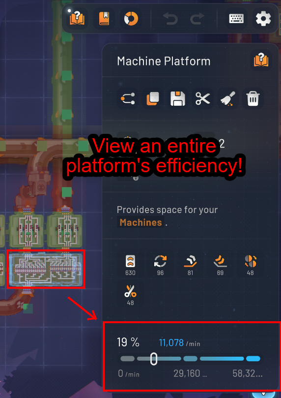

# Platform Efficiency Overlay

A shapez 2 mod that shows you what your factory is **actually** moving, and where it is
stuck — without placing a single belt reader.

Every machine, belt, space belt and space pipe is measured by counting the items that pass
through it, then washed in a colour from dark red to green according to how much of its
capacity it is using. Selecting a platform gives you its total output on the game's own
efficiency gauge.


Turn it on with the **Platform Efficiency** button in the visualization bar, bottom right,
next to the island grid and map markers. The state persists between sessions.

## Reading it

**Colour is how much of its capacity something is moving.** One scale for everything:

| | |
|---|---|
| dark red | stopped, or as good as |
| red → orange | struggling |
| yellow-green → green | keeping up |

**A green pip means it is fed.** That is the part throughput alone cannot tell you. Two
belts both at 16% need opposite responses, and the pip says which:

| | meaning | where to look |
|---|---|---|
| dark **with** a pip | fed, and still not keeping up | **here or downstream** |
| dark, **no** pip | starved | **upstream** |
| green | fine | — |

So you can walk a problem backwards: find the dark tile without a pip, follow it upstream,
and the first thing you meet that is dark *with* a pip is your bottleneck.

Zoom out to space view and the same reading applies per platform — one colour and one pip
for the whole thing, rolled up from everything built on it.

## Platform totals



Selecting a platform adds the game's live efficiency gauge to its side panel, showing what
the platform is shipping against everything it *could* ship. Every way off the platform
counts toward it:

- ports feeding a space belt
- ports packaging fluid into a space pipe
- ports jumping items straight to a platform docked alongside

A space belt or pipe runs a dozen lanes in parallel, and the gauge measures all of them as
one flow rather than sampling a single lane.

## Installing

Requires [Shapez Shifter](https://steamcommunity.com/sharedfiles/filedetails/?id=3542611357)
1.2 or newer, which itself pulls in MonoMod.RuntimeDetour.

Drop the built folder into:

```
%LOCALAPPDATA%Low\tobspr Games\shapez 2\mods\PlatformEfficiencyOverlay\
```

The mod is read-only: it measures and draws, and writes nothing to your save. Switching it
off leaves no trace, which is why `AffectsSaveGames` is `false`.

## Building

Needs the three environment variables the game sets up for you. Run shapez 2 once with
`--set-modding-env-vars`, or set them by hand:

| Variable | Points at |
|---|---|
| `SPZ2_PATH` | the game's `shapez 2_Data\Managed` folder |
| `SPZ2_PERSISTENT` | `%LOCALAPPDATA%Low\tobspr Games\shapez 2` |
| `SPZ2_SHIFTER` | the `ShapezShifter.dll` from the workshop item |

Then:

```
dotnet build
```

`OutputPath` points straight at the mods folder, so a build is an install. Restart the game
to pick up new code — the DLL is memory-mapped while it runs, so a rebuild cannot overwrite
it until the game closes. To check that your code compiles without quitting the game:

```
dotnet build -p:OutputPath=/tmp/verify/
```

## Tuning it live

New code needs a restart, so everything worth judging by eye is adjustable from the debug
console (**F1**) instead:

| Command | Does |
|---|---|
| `peo.report` | print every current value |
| `peo.inspect` | for the selected buildings: measured rate, ceiling, where that ceiling came from, and supply level |
| `peo.blocked-shade <0-1>` | how dark the bad end of the colour scale is |
| `peo.tint-alpha <0-1>` | opacity of the colour wash |
| `peo.tint-height <0-6>` | lift the wash if it fights with building tops |
| `peo.pips <0\|1>` | show the "it is fed" pips |
| `peo.saturation-threshold <0-1>` | how full counts as fed |
| `peo.machine-labels <0\|1>` | draw the measured number on each machine |
| `peo.platform-labels <0\|1>` | draw the rolled-up number on each platform |
| `peo.label-percent <0\|1>` | machine labels as a percentage rather than a rate |
| `peo.tracking <0\|1>` | stop measuring entirely — unhooks everything |

In-world numbers are **off** by default. They are drawn by the game's UI renderer, which
ignores depth, so they show through whatever is above them; the side panel is a better place
for exact figures. `peo.machine-labels 1` turns them on anyway.

## How it works

Throughput is counted, not estimated. Each tracked simulation gets a counter chained onto
its output lane's `PostAcceptHook`, which fires once per item handed over — so the number on
screen is a real count over a window of *simulation* time, correct across pausing and the
speed controls. Ceilings come from lane speed for anything that transports, and from the
building definition for anything that processes.

Cost is kept off the frame that matters. Rendering rides a postfix on `MapDrawer.Draw` and
only draws chunks the game's own culler has already reported visible, so it scales with what
is on screen rather than with the size of the save. The initial sweep that hooks every lane
is drained across frames against a time budget, because doing it in one frame stalls the
window long enough for Windows to call the game unresponsive.

If it ever costs more than it is worth on a very large base, `peo.tracking 0` removes every
hook immediately.

## Known limits

- **Speed research is not accounted for on machines.** A machine's ceiling comes from its
  base processing duration, so a fully upgraded machine reads as pinned at 100%.
- **Fluid between directly docked platforms is not measured.** It flows as a connected
  network with no discrete transfer to count, unlike a space pipe, which packages fluid into
  countable items. A pipe-docked platform may read low.
- **A mixed platform's gauge sums items and fluid packages.** The percentage is sound, since
  it is total actual over total capacity, but the absolute figure combines two different
  units.
- **In-world numbers show through geometry**, which is why they are off by default.

## Credits

Built on [Shapez Shifter](https://github.com/tobspr-games/shapez2-shifter) by tobspr Games.
