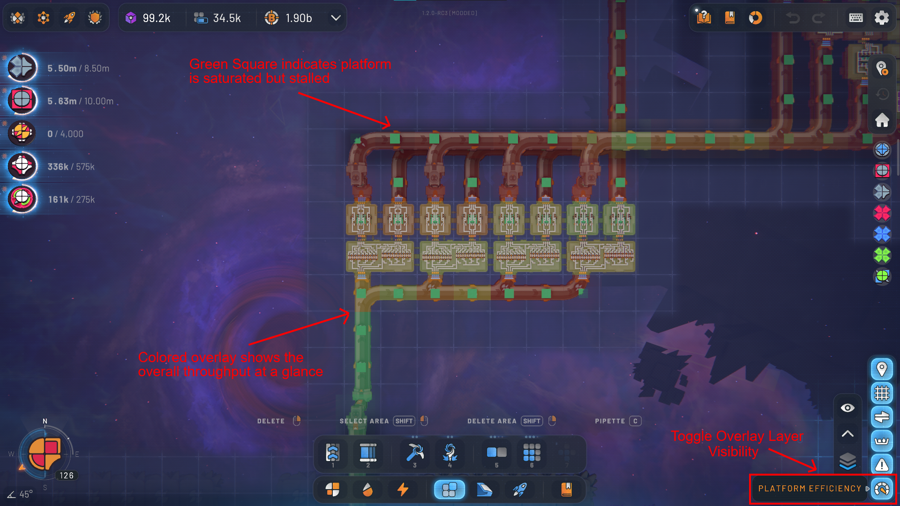
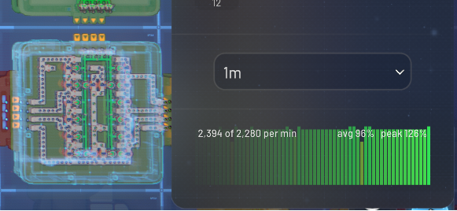

> [!IMPORTANT]
> **This repository has moved.** Platform Efficiency Viewer now lives alongside my other
> shapez 2 mods in <https://github.com/QuinnBast/Shapez2-Mods>, under
> `Shapez2-Space-Platform-Efficiencies/`. Its full history came with it.
>
> This repository is archived and no longer accepts changes.

# Platform Efficiency Viewer

See what your factory is actually moving, and where it is stuck — no belt readers required.

Switch on the overlay to colour every machine, belt, space belt and space pipe by how hard
it is working:



Select a machine or a platform for what it has been doing over time:



## Reading it

**Colour** is how much of its capacity something is using — dark red is stopped, green is
keeping up.

**A green pip** means goods are stuck there: something is sitting on the way out and
nothing is leaving. That is what tells you which way to walk:

| | |
|---|---|
| dark **with** a pip | goods waiting and not moving — the problem is here or downstream |
| dark, **no** pip | starved — the problem is upstream |

Zoom out and each platform gets a single colour, and a pip when its own ports cannot ship.

## Over time

Selecting a machine or a platform adds a chart of the capacity it has been using, over the
last **1m, 5m, 30m, 1h or 6h**. Hover a bar for the exact figure and how long ago it was;
the corner carries the current rate with the average and peak across the window.

Space belts and space pipes get the game's own efficiency gauge instead, measuring the
whole bundle rather than one lane of it. They keep no history: they outnumber the machines
several times over and say nothing a chart of the machine feeding them does not.

History costs roughly **35 MB** on a finished factory and is never written to your save.
`peo.history-enabled false` turns it off.

## Installing

Needs [Shapez Shifter](https://steamcommunity.com/sharedfiles/filedetails/?id=3542611357)
1.2 or newer. Put the mod folder in:

```
%LOCALAPPDATA%Low\tobspr Games\shapez 2\mods\PlatformEfficiencyOverlay\
```

Then enable it in the game's mod list and press the **Platform Efficiency** button in the
visualization bar, bottom right. It remembers whether it was on.

Nothing is written to your save, so you can remove it at any time.

## Options

The debug console (**F1**) has a few knobs, if the defaults do not suit you:

| | |
|---|---|
| `peo.report` | show all current settings |
| `peo.range 6h` | which window the charts show |
| `peo.history-enabled false` | stop keeping history (frees the memory on the next load) |
| `peo.machine-labels 1` | draw the measured number on each machine |
| `peo.tint-alpha 0.4` | make the colours more or less opaque |
| `peo.belt-zoom 400` | how far out belts keep their colour — lower it if panning stutters |
| `peo.pips 0` | hide the pips |
| `peo.panel-scroll false` | let a long side panel run past the bottom of the screen instead of scrolling |
| `peo.tracking 0` | stop measuring entirely |

## Working out why a number is what it is

Every figure is measured rather than estimated, but a percentage is only ever as good as
what it is divided by. These print the arithmetic:

| | |
|---|---|
| `peo.why` | every input to the selected machine's or platform's number, in order |
| `peo.inspect` | measured rate, ceiling and where the ceiling came from |
| `peo.history` | the same buckets the chart draws, as text |
| `peo.ports` | every port on the selected platform, with what it is measured against |
| `peo.clock` | whether recording is running, and on what clock |
| `peo.breakdown` | how many flows are tracked, and what the history is costing |

Everything they print also goes to `Player.log`.

## Known limits

- A machine's ceiling comes from its building definition scaled by your research. A
  building whose definition states no processing duration has no ceiling to be a
  percentage of, so it is measured against belt speed instead and will read low.
- A port a platform has built but never connected is left out of that platform's total; one
  that is connected and blocked is kept in, which is the case the number is for.
- Where a computed ceiling turns out lower than a rate actually achieved — belts compress
  items closer than their nominal spacing — the best rate seen becomes the ceiling. It does
  not decay, so a one-off spike leaves that flow reading low until the save is reloaded.
- The side panel's scrolling is built at runtime over the game's own panel. It has only
  been tried at one resolution; `peo.panel-scroll false` backs it out.

## Building it yourself

Set `SPZ2_PATH`, `SPZ2_PERSISTENT` and `SPZ2_SHIFTER` — running the game once with
`--set-modding-env-vars` does this for you — then `dotnet build`. The output goes straight
to the mods folder. Restart the game to pick up changes.

`dotnet build -p:Dev=true` stages to `mods-dev` instead of the mods folder, since the
installed copy is memory-mapped while the game runs and cannot be overwritten.

Built on [Shapez Shifter](https://github.com/tobspr-games/shapez2-shifter) by tobspr Games.
Licensed under [Apache 2.0](LICENSE).
